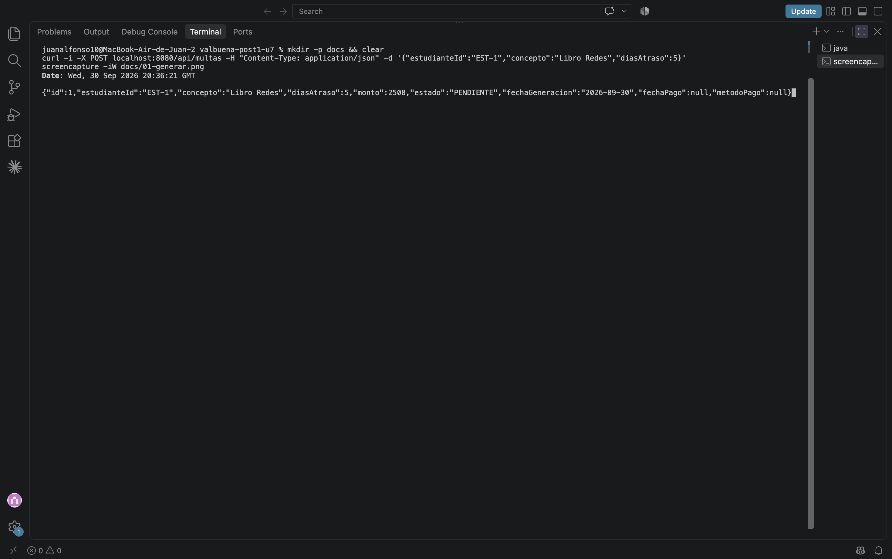
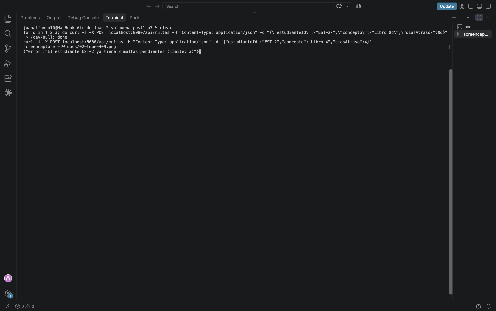
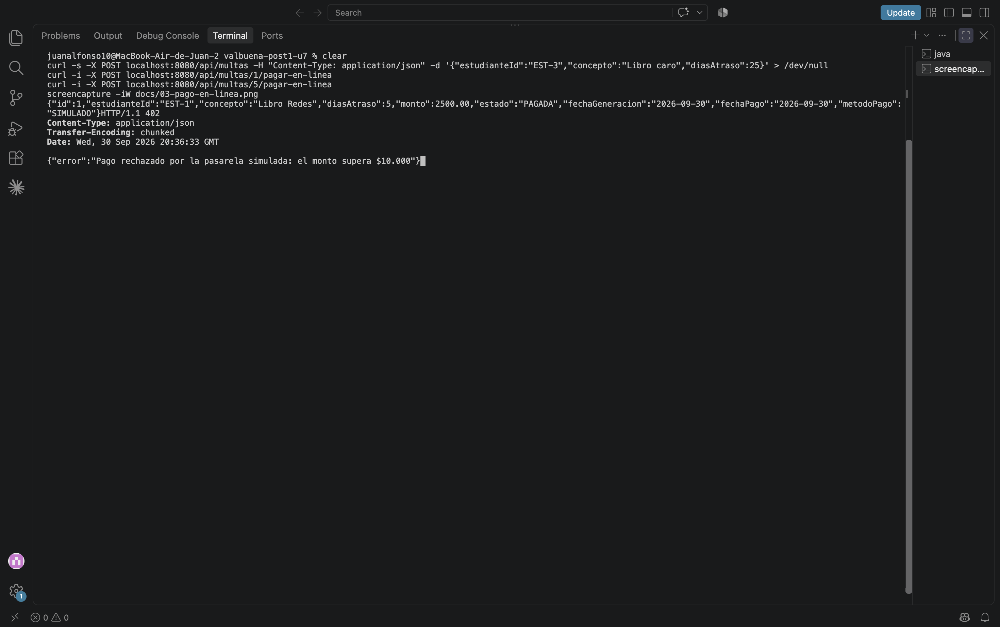
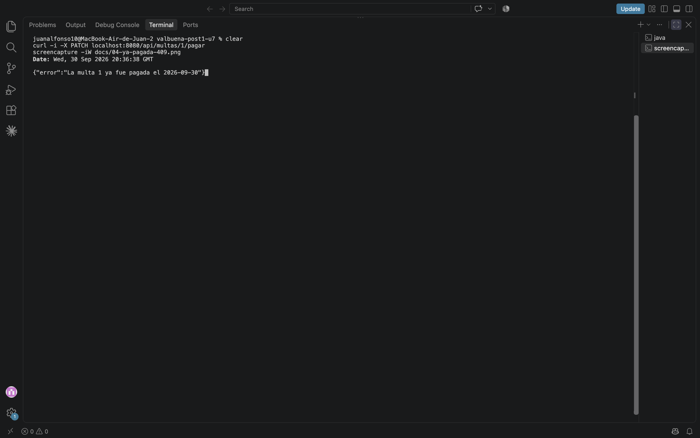

# Post-contenido — Unidad 7: Patrones Arquitectónicos I

## Descripción
Repositorio del post-contenido de la Unidad 7 de Patrones de Diseño de Software. Un único proyecto Spring Boot (`multas-biblioteca-api/`) para la gestión de multas de una biblioteca universitaria, con dos partes:

1. **Parte 1:** API REST en capas (`model/`, `repository/`, `service/`, `controller/`) sobre H2.
2. **Parte 2:** pago en línea de multas con dos pasarelas intercambiables por configuración (PagosUDES y Wompi), resuelto con un puerto de dominio y adaptadores **solo en la porción de pago**.

## Parte 1 — Arquitectura en capas

| Capa | Paquete | Responsabilidad |
|---|---|---|
| Presentación | `controller/` | `MultaController` expone `/api/multas`; `GlobalExceptionHandler` traduce excepciones de negocio a 400/404/409. |
| Aplicación | `service/` | `MultaService` orquesta los casos de uso y decide las reglas de negocio (tope de multas pendientes). |
| Dominio | `model/` | Entidad `Multa` con su propio comportamiento (`calcularMonto`, `marcarComoPagada`) y excepciones de negocio. |
| Infraestructura | `repository/` | `MultaRepository` (Spring Data JPA) con la consulta agregada `countByEstudianteIdAndEstado`. |

El controlador nunca accede al repositorio: siempre pasa por `MultaService`.

## Parte 2 — Pago en línea con dos pasarelas

**Opción elegida: C, un puerto de dominio con adaptadores, limitado a la porción de pago.** El resto del proyecto (`Multa`, `MultaRepository`, `MultaController`) sigue en capas; migrarlo todo a hexagonal sería sobre-ingeniería para este alcance.

- `domain/port/PasarelaPagoPort` y `domain/ResultadoPago` son Java puro: no importan Spring ni ningún cliente HTTP.
- `infrastructure/pago/PagosUdesAdapter` y `infrastructure/pago/WompiAdapter` traducen cada contrato HTTP externo al mismo `ResultadoPago`.
- `infrastructure/pago/PasarelaSimuladaAdapter` es un tercer adaptador para desarrollo y pruebas sin las pasarelas reales. Aprueba multas de hasta $10.000 y rechaza las mayores.
- El adaptador activo se elige con `app.pagos.proveedor` (`pagosudes` | `wompi` | `simulado`), sin tocar `MultaService` ni `MultaController`.

## Estructura de paquetes

```
multas-biblioteca-api/src/main/java/com/example/multas/
├── MultasApplication.java
├── controller/                 ← Presentación
│   ├── MultaController.java
│   ├── GenerarMultaRequest.java
│   └── GlobalExceptionHandler.java
├── service/                    ← Aplicación
│   └── MultaService.java       (depende de MultaRepository y de PasarelaPagoPort)
├── model/                      ← Dominio de la Parte 1
│   ├── Multa.java, EstadoMulta.java
│   └── MultaNotFoundException, LimiteMultasPendientesException, MultaYaPagadaException
├── repository/                 ← Infraestructura de persistencia
│   └── MultaRepository.java
├── domain/                     ← Parte 2: puerto y tipo de resultado, sin Spring
│   ├── port/PasarelaPagoPort.java
│   ├── ResultadoPago.java
│   └── PagoRechazadoException.java
└── infrastructure/             ← Parte 2: adaptadores, sí conocen Spring y HTTP
    ├── pago/PagosUdesAdapter.java
    ├── pago/WompiAdapter.java
    ├── pago/PasarelaSimuladaAdapter.java
    └── config/RestTemplateConfig.java
```

## Cómo ejecutar

```bash
cd multas-biblioteca-api
mvn clean package
mvn spring-boot:run
```

Para probar el pago en línea sin las pasarelas reales, arranca con la pasarela simulada:

```bash
mvn spring-boot:run -Dspring-boot.run.arguments=--app.pagos.proveedor=simulado
```

Endpoints:

| Método | Ruta | Respuestas |
|---|---|---|
| GET | `/api/multas` | 200 |
| GET | `/api/multas/{id}` | 200 · 404 |
| GET | `/api/multas/estudiante/{estudianteId}` | 200 |
| POST | `/api/multas` | 201 · 400 (validación) · 409 (tope de 3 pendientes) |
| PATCH | `/api/multas/{id}/pagar` | 200 · 409 (ya pagada) |
| POST | `/api/multas/{id}/pagar-en-linea` | 200 · 402 (rechazo de la pasarela) · 409 (ya pagada) |

## Evidencias

Los checkpoints de ambas partes están automatizados. Corre `mvn test` desde `multas-biblioteca-api/`:

| Prueba | Qué demuestra |
|---|---|
| `MultaControllerTest` | 201 con monto calculado, 400 sin `estudianteId`, 409 en la 4.ª multa pendiente, 404 para ID inexistente, 409 al pagar dos veces en ventanilla |
| `MultaServiceTest` | Tope del monto, límite de 3 pendientes, pago en ventanilla |
| `AdaptadoresPasarelaTest` | PagosUDES traduce `idTransaccion`/`estadoTransaccion`; Wompi envía centavos y traduce `reference`/`status`; una pasarela caída se traduce en pago no exitoso |
| `PagoEnLineaTest` | 200 al aprobar, 402 al rechazar, 409 al pagar en línea una multa ya pagada (en línea o en ventanilla) |
| `SeleccionPasarelaPorDefectoTest`, `SeleccionPasarelaWompiTest` | Cambiar `app.pagos.proveedor` cambia el adaptador activo sin recompilar Controller ni Service |

**Registro de multa (201)**


**Cuarta multa pendiente rechazada (409)**


**Pago en línea aprobado (200) y rechazado (402)**


**Pago de una multa ya pagada (409)**


## Herramientas utilizadas
- Java 17, Spring Boot 3.2, Spring Data JPA, H2, RestTemplate
- JUnit 5, MockMvc, MockRestServiceServer
- Apache Maven, curl, Git, GitHub

## Decisiones de diseño

### Punto de decisión 1 — Cálculo del monto: ¿entidad o Service?
`Multa.calcularMonto` vive en la entidad. El criterio: **si una regla no necesita ningún colaborador externo (Repository, otro Service), es candidata a vivir en el propio objeto de dominio.** El monto depende solo de los días de atraso, que recibe como parámetro. Tenerlo como método privado de `MultaService` también funcionaría, pero dejaría a `Multa` como un contenedor de datos sin comportamiento (modelo anémico). Además, cualquier otro punto que necesitara recalcular un monto tendría que duplicar la fórmula o pasar por el Service sin necesitarlo. Por la misma razón, `marcarComoPagada` también vive en la entidad y protege la invariante "no se paga dos veces".

### Punto de decisión 2 — Conteo de multas pendientes: ¿consulta o filtrado en memoria?
La regla "máximo 3 multas pendientes" sí necesita datos que solo la base de datos conoce. El **dato** se resuelve donde es eficiente, con `countByEstudianteIdAndEstado`, que Spring Data traduce a un `SELECT COUNT(*)`. La **decisión** ("¿se permite generar otra?") la toma exclusivamente `MultaService`. La alternativa, `findByEstudianteId` + filtrar con streams, trae a memoria todo el historial del estudiante en cada creación: con miles de multas por estudiante, el tiempo de respuesta de `POST /api/multas` crecería en proporción al historial, mientras que el `COUNT` devuelve un solo número.

### Punto de decisión 3 — Selección del adaptador activo
Se eligió `@ConditionalOnProperty`: según `app.pagos.proveedor`, solo **un** bean de `PasarelaPagoPort` existe en el contexto. `MultaService` lo pide por constructor sin `@Qualifier` ni condicionales propios. La alternativa, inyectar un `Map<String, PasarelaPagoPort>` y elegir la clave en tiempo de ejecución, es más flexible (permite cambiar de proveedor sin reiniciar), pero se descartó por dos razones. Primero, el requisito real es **una pasarela fija por sede** durante el piloto. Segundo, `MultaService` tendría que conocer las claves de configuración de cada proveedor, que es justo el detalle que el puerto debe esconder. Agregar `PasarelaSimuladaAdapter` confirmó la decisión: fue una clase nueva con su propio `havingValue`, sin tocar una línea del Service.

### Punto de decisión 4 — Diseño del puerto y del tipo de resultado
PagosUDES responde `idTransaccion`/`estadoTransaccion` y Wompi trabaja en centavos con `reference`/`status`, pero **ambos adaptadores devuelven el mismo `ResultadoPago`**. Si el puerto devolviera el DTO propio de cada pasarela, o tuviera un método por proveedor, `MultaService` tendría que conocer y distinguir ambos formatos, y agregar una tercera pasarela obligaría a modificar el Service además de crear el adaptador.

El nombre de los campos también importa. Si `ResultadoPago` tuviera `idTransaccion` en lugar de `referenciaExterna`, `WompiAdapter` tendría que meter en ese campo algo que Wompi no llama así (su `reference`) o inventarle un valor. Esa sería la señal de que el tipo de dominio está sesgado hacia un proveedor concreto. `referenciaExterna` describe lo que ambas pasarelas devuelven sin adoptar el vocabulario de ninguna.

### Trade-off considerado — Parte 2
**Opción descartada:** B, una interfaz Strategy dentro de `service/` con dos implementaciones `@Service`. La opción A (un `if` en `MultaService`) se descartó de entrada, porque metería los detalles HTTP de ambas pasarelas en el Service.

**A favor de la opción elegida (C):**
1. Los contratos HTTP de PagosUDES y Wompi son distintos (campos, centavos, estados). Con el puerto, esa traducción queda encerrada en cada adaptador y nunca se filtra hacia `MultaService`.
2. El número de pasarelas va a cambiar al terminar el piloto (se agrega una o se quita otra). Con el puerto, eso es crear o borrar una clase en `infrastructure/`, como ya se demostró con `PasarelaSimuladaAdapter`.
3. `domain/` es Java puro, así que el contrato de pago se puede razonar y probar sin Spring. `AdaptadoresPasarelaTest` prueba cada traducción de forma aislada.

**En contra (lo que costó):** dos paquetes nuevos (`domain/`, `infrastructure/`) y un tipo de resultado propio, es decir, más clases e indirección que la opción B, que habría resuelto la intercambiabilidad con una interfaz en `service/`. Además, el proyecto queda con dos estilos (capas en la Parte 1, puerto en la porción de pago), y eso hay que explicarlo a quien lo mantenga.

**¿Se revertiría?** Si el piloto terminara con **una sola** pasarela y sin planes de agregar otra, el argumento 2 desaparece. Aun así, se mantendría el puerto: `ResultadoPago` sigue aislando al dominio del contrato HTTP del proveedor, y el costo ya está pagado. Revertir a una llamada directa desde el Service solo se justificaría si el adaptador empezara a crecer con lógica que en realidad es de negocio.

## Conclusiones
La Parte 1 mostró que la arquitectura en capas se justifica por las reglas que contiene: `MultaService` existe porque decide el tope de pendientes, y `Multa` tiene comportamiento porque el monto no necesita a nadie más. Lo más difícil de la Parte 2 fue que las opciones B y C resolvían el requisito funcional por igual. La diferencia apareció al mirar los contratos HTTP: con Strategy en `service/`, los formatos de cada pasarela habrían quedado en la misma capa que las reglas de negocio. Limitar el puerto a la porción de pago evitó la sobre-ingeniería de migrar todo el proyecto, y el tercer adaptador (simulado) confirmó en la práctica que agregar un proveedor no toca el Service.
